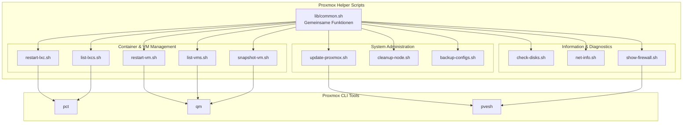

# Design Document: Proxmox Helper Scripts

## Overview

Die Proxmox Helper Scripts sind eine Sammlung von Bash-Skripten, die häufige Verwaltungsaufgaben auf Proxmox VE Hosts vereinfachen. Das Design folgt einem modularen Ansatz mit einer gemeinsamen Bibliothek für wiederkehrende Funktionen (Fehlerbehandlung, Root-Check, Farbausgabe) und individuellen Skripten für spezifische Aufgaben.

Die Skripte nutzen die nativen Proxmox-CLI-Tools (`pct`, `qm`, `pvesh`, `pveversion`) und Standard-Linux-Werkzeuge. Alle Skripte folgen den Shell-Scripting-Standards des Projekts.

## Architecture



### Design-Entscheidungen

1. **Gemeinsame Bibliothek (`lib/common.sh`)**: Vermeidet Code-Duplikation für Root-Check, Farbausgabe, Fehlerbehandlung und Bestätigungsabfragen.
2. **Graceful Stop statt Reboot**: `pct stop` + `pct start` bzw. `qm stop` + `qm start` statt `pct reboot`/`qm reboot`, da dies mehr Kontrolle über den Prozess bietet und Fehler granularer behandelt werden können.
3. **Argument-Mode mit Interactive-Fallback**: Skripte akzeptieren IDs als Argument für Scripting/Automation, fallen aber auf interaktive Auswahl zurück für manuelle Nutzung.
4. **Keine externen Abhängigkeiten**: Nur Standard-Linux-Tools und Proxmox-CLI-Tools werden verwendet.

## Components and Interfaces

### Gemeinsame Bibliothek: `lib/common.sh`

```bash
# Farbdefinitionen
RED, GREEN, YELLOW, BLUE, NC

# Ausgabe-Funktionen
msg_info(message)      # Blaue Info-Meldung
msg_ok(message)        # Grüne Erfolgsmeldung
msg_warn(message)      # Gelbe Warnung
msg_error(message)     # Rote Fehlermeldung

# Prüfungen
check_root()           # Prüft Root-Berechtigung, beendet bei Fehler
check_command(cmd)     # Prüft ob Kommando verfügbar ist

# Interaktion
confirm(prompt)        # Ja/Nein-Bestätigung, gibt 0/1 zurück
select_from_list(items[], prompt)  # Interaktive Auswahl aus Liste
```

### restart-lxc.sh

```bash
#!/bin/bash
# Schnittstelle:
#   Argument: CTID (optional)
#   Interaktiv: Auswahl aus laufenden Containern
#
# Funktionen:
#   get_running_containers()  -> Liste: "CTID HOSTNAME STATUS"
#   restart_container(ctid)   -> Graceful Stop + Start
#   main()                    -> Argument-Parsing oder Interactive Mode
```

### restart-vm.sh

```bash
#!/bin/bash
# Schnittstelle:
#   Argument: VMID (optional)
#   Interaktiv: Auswahl aus laufenden VMs
#
# Funktionen:
#   get_running_vms()    -> Liste: "VMID NAME STATUS"
#   restart_vm(vmid)     -> Graceful Stop + Start
#   main()               -> Argument-Parsing oder Interactive Mode
```

### snapshot-vm.sh

```bash
#!/bin/bash
# Schnittstelle:
#   Argument: VMID (optional)
#   Interaktiv: Auswahl aus VMs
#
# Funktionen:
#   get_all_vms()              -> Liste: "VMID NAME STATUS"
#   create_snapshot(vmid)      -> Snapshot mit Zeitstempel-Name
#   main()                     -> Argument-Parsing oder Interactive Mode
```

### update-proxmox.sh

```bash
#!/bin/bash
# Funktionen:
#   check_updates()       -> Prüft verfügbare Updates
#   show_update_summary() -> Zeigt Update-Zusammenfassung
#   perform_update()      -> Führt apt update && apt upgrade durch
#   main()                -> Prüfung, Bestätigung, Update
```

### cleanup-node.sh

```bash
#!/bin/bash
# Funktionen:
#   get_disk_usage()      -> Aktuelle Belegung vor Bereinigung
#   clean_apt_cache()     -> apt clean + autoclean
#   remove_unused()       -> apt autoremove
#   clean_temp_files()    -> /tmp und Logs bereinigen
#   show_savings()        -> Freigegebenen Speicher anzeigen
#   main()                -> Zusammenfassung, Bestätigung, Bereinigung
```

### list-vms.sh / list-lxcs.sh

```bash
#!/bin/bash
# Funktionen:
#   get_all_items()       -> Alle VMs/Container mit Details
#   format_table(items[]) -> Tabellarische Ausgabe
#   main()                -> Daten sammeln und formatiert ausgeben
```

### backup-configs.sh

```bash
#!/bin/bash
# Schnittstelle:
#   Argument: Zielverzeichnis (optional, Standard: /root/pve-backups)
#
# Funktionen:
#   create_backup_dir(path)    -> Erstellt datiertes Backup-Verzeichnis
#   backup_pve_config()        -> Sichert /etc/pve/
#   backup_network_config()    -> Sichert /etc/network/
#   create_archive(dir)        -> Erstellt tar.gz Archiv
#   main()                     -> Backup-Prozess orchestrieren
```

### check-disks.sh

```bash
#!/bin/bash
# Funktionen:
#   show_block_devices()    -> lsblk Übersicht
#   show_smart_status()     -> SMART-Daten pro Festplatte
#   show_storage_pools()    -> Proxmox Storage mit Belegung
#   main()                  -> Alle Informationen anzeigen
```

### net-info.sh

```bash
#!/bin/bash
# Funktionen:
#   show_bridges()       -> Linux Bridges und Mitglieder
#   show_interfaces()    -> Interfaces mit IP-Adressen
#   show_routes()        -> Routing-Tabelle
#   show_dns()           -> DNS-Konfiguration
#   main()               -> Alle Netzwerk-Infos anzeigen
```

### show-firewall.sh

```bash
#!/bin/bash
# Funktionen:
#   show_fw_status()         -> Firewall aktiv/inaktiv
#   show_datacenter_rules()  -> Datacenter-Level Regeln
#   show_host_rules()        -> Host-Level Regeln
#   main()                   -> Status + Regeln anzeigen
```

### docs/proxmox-cheatsheet.md

Markdown-Dokument mit folgender Struktur:

```markdown
# Proxmox VE CLI Cheat Sheet

## Container-Verwaltung (pct)
- Erstellen, Starten, Stoppen, Neustarten, Löschen
- Konfiguration anzeigen/ändern, Console, Enter

## VM-Verwaltung (qm)
- Erstellen, Starten, Stoppen, Neustarten, Löschen
- Snapshots, Migration, Clone, Template

## Storage (pvesm)
- Status, Hinzufügen, Entfernen, Scan

## Cluster (pvecm)
- Status, Nodes, Join, Create

## Netzwerk
- Bridges, VLANs, Firewall-Befehle

## Backup & Restore (vzdump/qmrestore/pct restore)
- Backup erstellen, wiederherstellen, Zeitpläne
```

### README.md Externe Referenzen

Die README enthält einen dedizierten Abschnitt mit den Links aus `externalrefs.txt`, gruppiert in:
- **Offizielle Proxmox-Ressourcen**: Dokumentation, Wiki, Forum
- **Community-Projekte**: ProxMenux, Proxmox Hardening Guide, ProxForge
- **Monitoring & Management**: PegaProx, PatchMon

## Data Models

Die Skripte arbeiten primär mit textuellen Daten aus Proxmox-CLI-Ausgaben. Es gibt keine persistenten Datenmodelle im klassischen Sinne, aber folgende Datenstrukturen werden intern verwendet:

### Container/VM-Informationen

```
CTID|HOSTNAME|STATUS|MEM|DISK
VMID|NAME|STATUS|CPUS|MEM
```

Quelle: `pct list`, `qm list`

### Backup-Archiv-Struktur

```
pve-backup-YYYY-MM-DD_HHMMSS/
├── etc-pve/           # Kopie von /etc/pve/
├── etc-network/       # Kopie von /etc/network/
└── manifest.txt       # Liste gesicherter Dateien mit Zeitstempel
```

### Snapshot-Benennung

```
Format: pre-maintenance-YYYYMMDD-HHMMSS
Beispiel: pre-maintenance-20250101-143022
```

### Projektverzeichnis-Struktur

```
proxmox-helper-scripts/
├── README.md
├── externalrefs.txt
├── docs/
│   └── proxmox-cheatsheet.md
├── lib/
│   └── common.sh
└── scripts/
    ├── restart-lxc.sh
    ├── restart-vm.sh
    ├── snapshot-vm.sh
    ├── update-proxmox.sh
    ├── cleanup-node.sh
    ├── list-vms.sh
    ├── list-lxcs.sh
    ├── backup-configs.sh
    ├── check-disks.sh
    ├── net-info.sh
    └── show-firewall.sh
```


## Correctness Properties

*A property is a characteristic or behavior that should hold true across all valid executions of a system—essentially, a formal statement about what the system should do. Properties serve as the bridge between human-readable specifications and machine-verifiable correctness guarantees.*

Based on the prework analysis, the following properties are testable across the script collection. Many of the requirements involve system-level operations (apt, pct, qm, smartctl) that require a live Proxmox environment and are not amenable to property-based testing. The testable properties focus on static analysis, naming conventions, and output formatting logic.

### Property 1: README documents all scripts

*For any* script file present in the `scripts/` directory, the README.md should contain both a mention of that script's filename and a usage example for it.

**Validates: Requirements 1.2, 1.4**

### Property 2: Graceful restart sequence

*For any* restart script (restart-lxc.sh, restart-vm.sh) and any valid ID, the script logic should invoke the stop command before the start command (never start without stop, never reboot directly).

**Validates: Requirements 2.1, 3.1**

### Property 3: Non-existent ID produces error exit

*For any* script that accepts an ID argument (restart-lxc.sh, restart-vm.sh, snapshot-vm.sh) and any non-existent ID value, the script should exit with code 1 and produce an error message on stderr.

**Validates: Requirements 2.4, 3.3, 11.5**

### Property 4: List output contains all required fields

*For any* VM or container data set, the list scripts (list-vms.sh, list-lxcs.sh) should produce output containing all required fields (ID, name/hostname, status, resources) formatted as aligned columns.

**Validates: Requirements 6.1, 6.2, 7.1, 7.2**

### Property 5: Timestamp-based naming follows format

*For any* point in time, generated names (backup archives and snapshot names) should follow their respective format patterns (`pve-backup-YYYY-MM-DD_HHMMSS` and `pre-maintenance-YYYYMMDD-HHMMSS`) and contain a valid, parseable timestamp.

**Validates: Requirements 8.3, 11.3**

### Property 6: Script structure compliance

*For any* script in the collection, it should contain: (a) `#!/bin/bash` as the first line, (b) `set -euo pipefail` within the first 10 lines, (c) a header comment block with description, and (d) a root permission check before any operational logic.

**Validates: Requirements 13.1, 13.2, 13.3, 13.4, 13.5**

### Property 7: ShellCheck compliance

*For any* script in the collection, running `shellcheck` should produce zero errors (exit code 0).

**Validates: Requirements 13.6**

### Property 8: Function documentation

*For any* function definition in any script, there should be a comment on the line(s) immediately preceding the function declaration describing its purpose.

**Validates: Requirements 13.7**

## Error Handling

### Allgemeine Fehlerbehandlung (via `lib/common.sh`)

| Fehlerfall | Verhalten |
|---|---|
| Kein Root-Zugriff | Fehlermeldung + Exit 1 |
| Benötigtes Kommando fehlt (pct, qm, etc.) | Fehlermeldung + Exit 1 |
| Ungültige/nicht-existente ID | Fehlermeldung + Exit 1 |
| Graceful Stop fehlgeschlagen | Fehlermeldung mit Details + Exit 1 |
| Start nach Stop fehlgeschlagen | Fehlermeldung + aktuellen Status anzeigen + Exit 1 |
| Keine Einträge vorhanden (leere Liste) | Info-Meldung + Exit 0 |
| Benutzer bricht Bestätigung ab | Info-Meldung + Exit 0 |

### Exit-Code-Konvention

- `0`: Erfolg oder erwarteter Abbruch (keine Aktion nötig)
- `1`: Fehler (ungültige Eingabe, fehlende Berechtigung, Kommando fehlgeschlagen)

### Fehlerausgabe

- Fehlermeldungen gehen an stderr (`>&2`)
- Farbcodierung: Rot für Fehler, Gelb für Warnungen
- Jede Fehlermeldung enthält den Kontext (welches Skript, welche ID, welcher Schritt)

## Testing Strategy

### Statische Analyse (Primärer Testansatz)

Da die Skripte primär mit System-Tools interagieren und eine Live-Proxmox-Umgebung benötigen, liegt der Schwerpunkt auf statischer Analyse:

1. **ShellCheck**: Alle Skripte müssen `shellcheck` ohne Fehler bestehen
2. **Syntax-Validierung**: `bash -n script.sh` für alle Skripte
3. **Struktur-Checks**: Automatisierte Prüfung der Konventionen (Shebang, set -euo pipefail, Root-Check, Header)

### Property-Based Testing

**Library**: [bats-core](https://github.com/bats-core/bats-core) (Bash Automated Testing System)

Property-basierte Tests werden für die statisch prüfbaren Eigenschaften implementiert:

- **Property 1**: Iteriere über alle Skripte in `scripts/`, prüfe README-Inhalt
- **Property 4**: Teste Formatierungsfunktionen mit verschiedenen Eingabedaten
- **Property 5**: Teste Namensgenerierung mit verschiedenen Zeitstempeln
- **Property 6**: Iteriere über alle Skripte, prüfe Struktur-Elemente
- **Property 7**: Führe shellcheck auf allen Skripten aus
- **Property 8**: Parse alle Skripte nach Funktionsdefinitionen, prüfe Kommentare

**Konfiguration**: Minimum 100 Iterationen pro Property-Test (wo randomisierte Eingaben möglich sind, z.B. Zeitstempel-Generierung).

**Tag-Format**: `# Feature: proxmox-helper-scripts, Property N: <property_text>`

### Unit Tests (bats-core)

Spezifische Beispiel-Tests für:
- Edge Cases: Leere Listen, bereits gestoppte Container, fehlende Kommandos
- Fehlerbehandlung: Ungültige CTIDs/VMIDs, fehlende Berechtigungen
- Ausgabeformat: Korrekte Tabellenformatierung bei bekannten Eingaben

### Integrationstests (manuell auf Proxmox-System)

Für die system-abhängigen Funktionen (pct, qm, apt) sind manuelle Tests auf einem Proxmox-System erforderlich:
- Restart-Skripte mit echten Containern/VMs
- Update-Skript auf Test-Node
- Backup-Skript mit echtem /etc/pve/
